# Scrum Desk

Scrum Desk — a self-hosted morning board for your daily opening / standup, with login accounts,
a SQLite database, and JIRA Cloud integration — all in one Docker container.

- **Login & users** — first run creates the admin account. Admins can create more users:
  - **Admin** — edit everything, sync JIRA, manage users
  - **Viewer** — view-only: see the board and download reports, cannot change data
- **Start each standup** — a day only becomes a standup day when an admin presses
  **Start standup**; days never started (holidays, weekends) are "no standup"
- **Attendance per member, per day** — Present · Late (for opening) · On leave · Sick · No show
- **Notes per member** — Yesterday · Today · Blockers, autosaved to the database
- **JIRA Cloud sync** — pulls the current sprint; each ticket shows its **status badge**
  (To Do / In Progress / Done / your own statuses), grouped per member
- **Auto-refresh on sign-in** — JIRA data is refreshed automatically every time you log in
  (button available too)
- **Daily report** — copy formatted standup notes or download a day as an Excel workbook
- **History** — browse started days in a calendar, inspect attendance and blockers, then reopen or copy a day
- **Reports** — one tab for monthly attendance, sprint delivery (KPI), the Performance report and Blockers
- **Blocker tracking** — a blocker left open at the last standup comes back on the next board as
  **Still blocked? / Resolved**; carried blockers show how many standup days they have been open,
  and **Reports → Blockers** lists who is blocked now plus a blocker log for retrospectives (see [Blockers](#blockers))
- **Monthly attendance** — a colour-coded day-by-day grid with member totals and rates;
  **Download Excel** gives a .xlsx with Summary, Attendance and Daily detail sheets
  (viewers can use it too)
- **Data survives everything** — SQLite database on a mounted volume; browsers can come and go
- **Full encrypted backup & restore** — admins download one password-protected file with the
  database, configuration and app files, and restore the database from it after a checked review
  (see [Backup & restore](#backup--restore))
- **Appearance** — a light palette and a black dark theme, switched from the header’s **Account** menu. The choice is saved per browser; new browsers follow the operating system theme.

The interface uses Maven Pro for body text, Georgia for quotations, and Monaco for code where available. Display headings use Big Noodle Titling if it is installed on the viewing device, with Barlow Condensed as the web fallback.

## Screenshots

These captures use generated demo members, example.test addresses and DEMO ticket keys. They were
rendered from the app with intercepted requests; no real account, database or JIRA data was used.
Click an image to open it at full size. Regenerate them with `python scripts/capture-ui-pages.py`
(requires Python Playwright and Chrome or Playwright Chromium); add names such as `today` to
capture only those.

| Today | Sprint board |
| --- | --- |
| [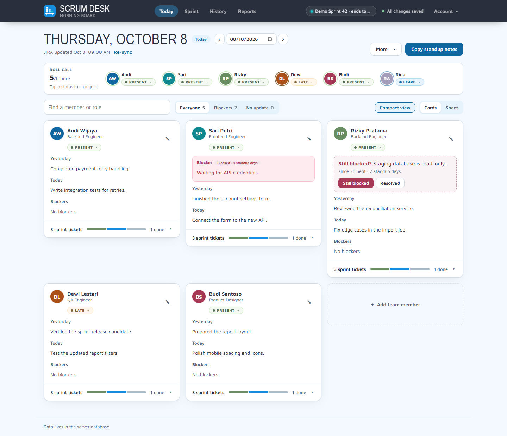](docs/screenshots/today.png) | [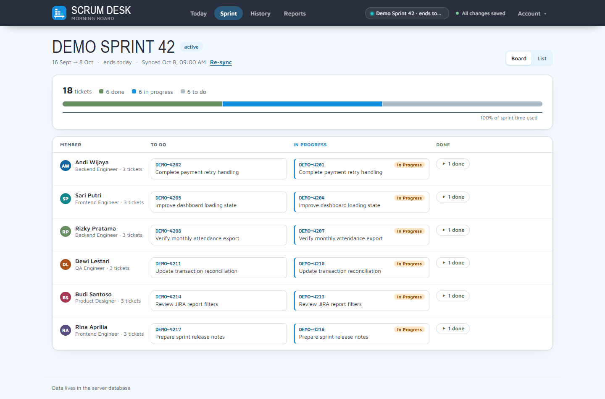](docs/screenshots/sprint-board.png) |
| Sprint list | History |
| [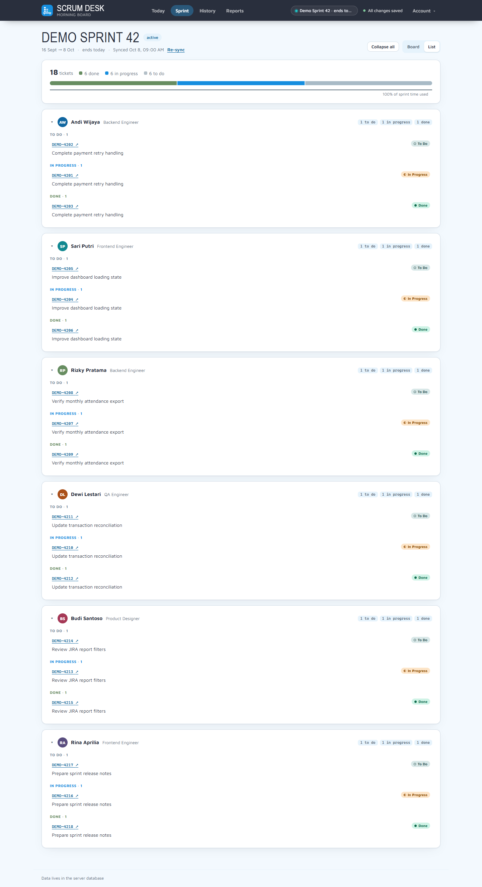](docs/screenshots/sprint-list.png) | [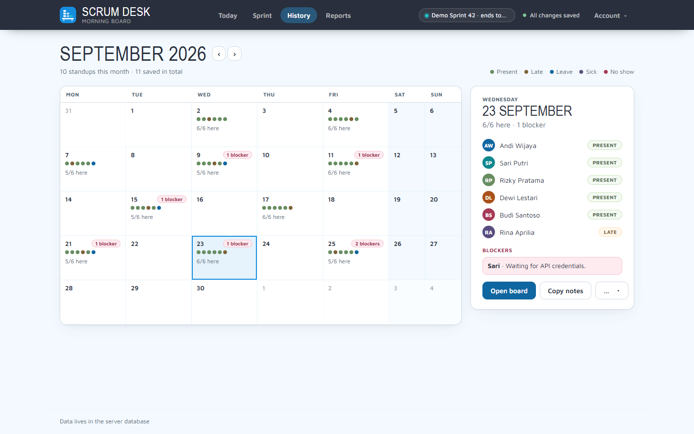](docs/screenshots/history.png) |
| Reports: Attendance | Reports: Sprint delivery |
| [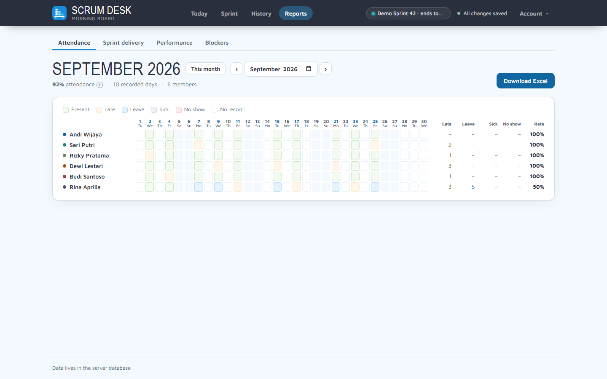](docs/screenshots/attendance-report.png) | [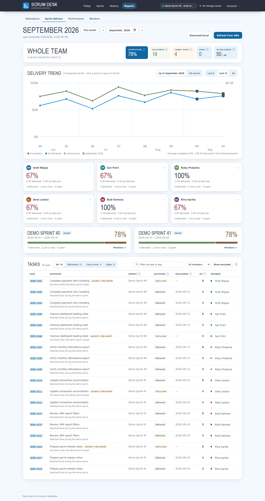](docs/screenshots/sprint-delivery-report.png) |
| Reports: Performance | Reports: Blockers |
| [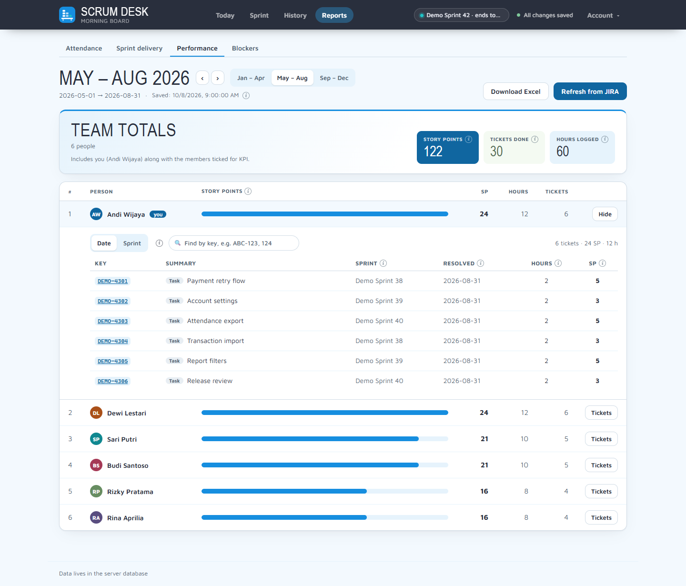](docs/screenshots/performance-report.png) | [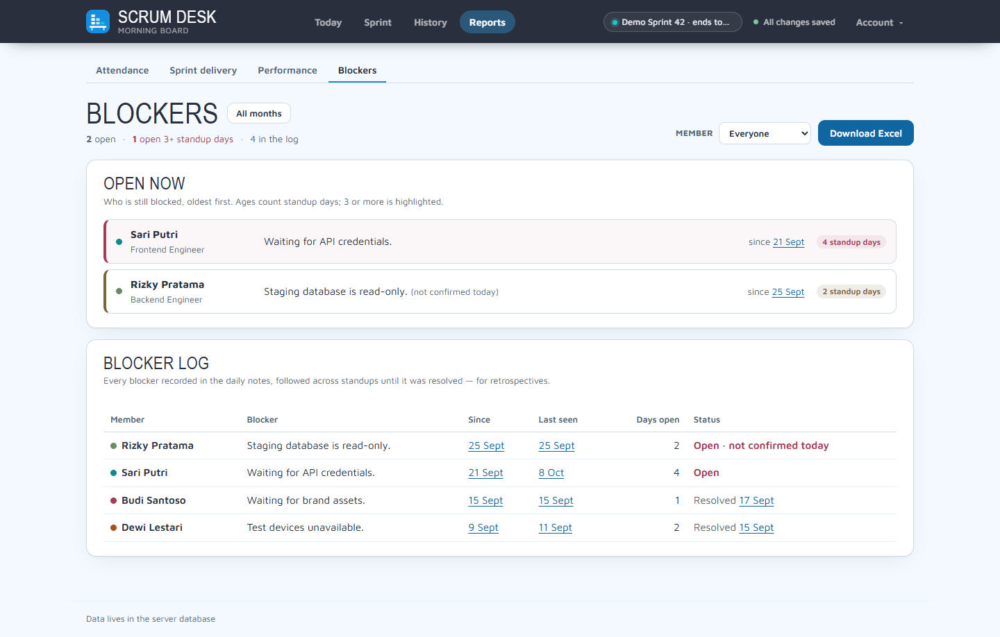](docs/screenshots/blockers-report.png) |
| Settings: Team members | Settings: JIRA connection |
| [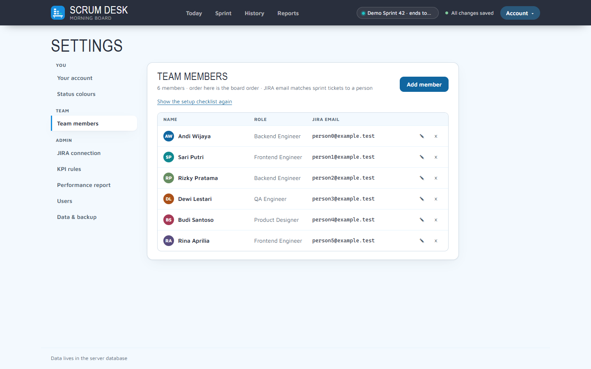](docs/screenshots/settings-team.png) | [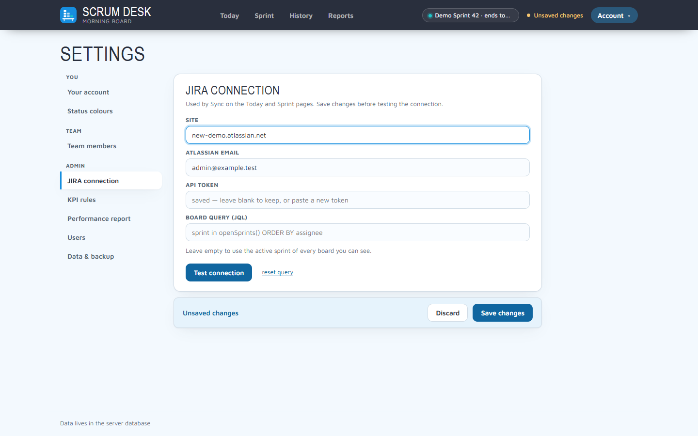](docs/screenshots/settings-jira.png) |
| Settings: Data & backup | |
| [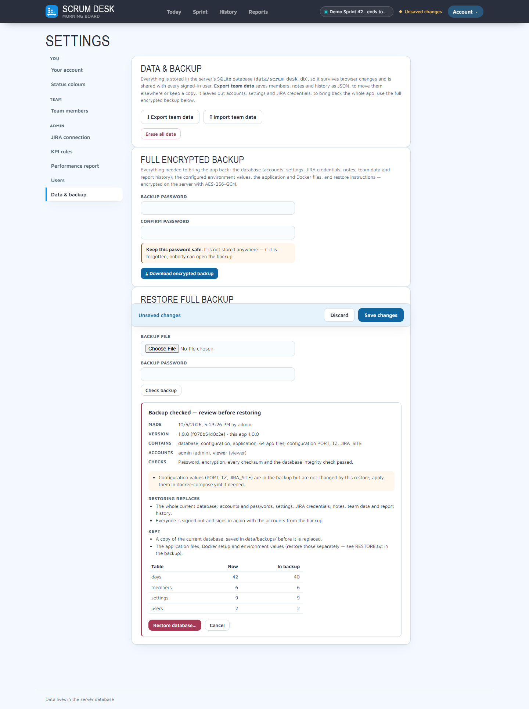](docs/screenshots/settings-backup.png) | |

## Board controls

- **Compact view** starts with readable notes. Click a note to edit it, then choose
  **Done editing** to return to reading. Notes still autosave while typing. Turn off
  Compact view to keep every note editor open; this preference stays in your browser.
  Viewers always see plain, readable notes. Sprint tickets start collapsed in Compact
  view and expanded otherwise; switching the view resets any tickets you opened or closed.
- **Sprint** opens in **Board** mode with a progress summary and per-member To do,
  In progress and Done columns. Done tickets expand from their count. Switch to **List** for
  collapsible member sections; **Collapse all** / **Expand all** toggles them together.
  Only tickets matched to a member of the selected team appear in the view and its totals.
- **Find a member or role** filters the board, including the Away strip. Blocker and
  team filters still apply. On Today, open or close a member's **Sprint tickets** panel;
  your choice stays in place while using the page. Each ticket key opens JIRA in a new tab.
- Each member’s ticket summary shows **To do / In progress / Done** counts. Use
  **All / Active / Done** to filter that member’s tickets; Active includes To do and
  In progress. Filters stay selected for that member and date while using the page.
- The URL preserves the view, team, date, report month, Performance report period and Settings tab.
  Refresh, bookmark, share, or use browser Back/Forward to return to that selection.
  Shared links respect the signed-in account’s permissions.
- Remove members through **Account → Settings → Team members → Remove**. The Undo toast restores
  accidental removals; Today keeps the edit action.
- The header has a **Reports** tab with **Attendance**, **Sprint delivery** and, for
  eligible accounts, **Performance** sub-tabs. **Account** opens Settings, the theme
  switch and sign-out. Settings sections are grouped under You, Team and Admin.
  **More actions** on Today holds the daily download and Cancel standup.
- The save status in the header stays visible on editable screens. In the **JIRA connection**
  settings tab, edits stay pending until **Save changes**; **Discard** restores saved
  values, and **Test connection** saves pending changes first. Other settings save on
  change or blur. Failed saves show **Not saved** and the Retry banner. Today also shows
  when its JIRA snapshot was updated.

## Run it (one container)

First time:

```bash
docker compose up -d --build
```

Open **http://localhost:3001** — you'll be asked to create the admin account. That
screen needs the one-time **setup code** printed in the server log, so only someone
with access to the server can claim the admin account:

```bash
docker compose logs scrum-desk    # look for "First-time setup code: ..."
```

(Or set your own with the `SETUP_CODE` environment variable.)

Every day after that:

```bash
docker start scrum-desk    # start (or: docker compose up -d)
docker stop scrum-desk     # stop  (or: docker compose down)
```

Data lives in `./data/scrum-desk.db` (SQLite). Stop the container and copy the
`data` folder to back it up, or use a full backup from the app (below).

The container restarts on its own after a crash, a reboot or a database restore
(`restart: unless-stopped`); `docker stop` / `docker compose down` still stop it for good.

### Backup & restore

**Settings → Data & backup** (admins) has two kinds of backup:

- **Export team data** — members, notes and history as JSON. No accounts, settings
  or JIRA credentials.
- **Full encrypted backup** — everything needed to bring the app back: the database
  (accounts, settings, JIRA credentials, notes, team data, report history), the
  configured environment values, the application and Docker files, version info,
  checksums and a `RESTORE.txt`. It is encrypted on the server (AES-256-GCM, key from
  your password through scrypt with a random salt). The password is never stored or
  logged — **if it is forgotten, the backup cannot be opened.** Over plain HTTP from
  another machine the password crosses the network unencrypted; prefer `localhost` or HTTPS.

**Restore full backup** checks the file first (password, checksums, archive paths,
database integrity, at least one admin) and shows what it holds and what would be
replaced — nothing changes until you type `RESTORE`. The app then saves the current
database to `data/backups/before-restore-<time>.db`, swaps in the one from the backup
at start-up and restarts. Everyone signs in again with the accounts from the backup.
If anything fails, the current database stays as it was (the reason is shown in the
panel). A current database too damaged to read is copied as-is and still replaced; if no
copy can be saved at all (disk full, permissions), the restore stays queued and is tried
again at the next start. The UI restores the **database only**; application and Docker files are a
separate step.

**When the app does not start** (from the folder with `docker-compose.yml`):

```bash
docker compose stop scrum-desk
docker compose run --rm -it --no-deps -v "$PWD/backup.dsbackup:/tmp/restore.dsbackup:ro" \
  scrum-desk node scripts/restore-backup.js restore-db /tmp/restore.dsbackup --data /app/data
docker compose up -d        # applies the restore, keeping a copy of the old database
```

Without Docker: `node scripts/restore-backup.js restore-db backup.dsbackup --data ./data`,
then start the app. The tool asks for the password (or reads `BACKUP_PASSWORD`).

**Rebuild everything on a new machine** (only Node 18+ needed to unpack; from any copy of the app):

```bash
node scripts/restore-backup.js inspect backup.dsbackup            # what is inside
node scripts/restore-backup.js extract backup.dsbackup ./scrum-desk
cd scrum-desk               # app + Docker files, data/scrum-desk.db, app.env
sudo chown -R 1000:1000 data # Linux/WSL: the container user must own it
# copy what you need from app.env into docker-compose.yml "environment:", then:
docker compose up -d --build
```

`app.env` holds the saved configuration values, including secrets — keep it private
and delete it when done.

> The app must always be reached at the same URL (e.g. `localhost:3001`) — that is
> where your login session lives.

**Upgrading.** Pull the new code, then `docker compose up -d --build`. The container
runs as the unprivileged user uid 1000, so the `data` folder must be writable by it.
Installs made before this change created root-owned files; fix them once with
`sudo chown -R 1000:1000 ./data` (Linux/WSL) before starting the new image.

Installs from before the rename to Scrum Desk: run `docker compose up -d --build --remove-orphans`
once, which replaces the container under its old name (otherwise it keeps port 3001). On start the
database file is renamed to `data/scrum-desk.db` automatically, browsers keep their saved settings,
and older `.dsbackup` files can still be checked and restored.

### Run without Docker

Requires Node 18+ and one `npm install`:

```bash
npm install
npm start        # http://localhost:3000
npm test         # integration tests against a temporary database
```

`node_modules` contains a native SQLite module built for the OS that ran
`npm install`. If you switch between Windows and WSL, run `npm rebuild better-sqlite3`
on the new side.

On Windows you can double-click `start.bat` (uses port 3001).

## Set it up for your team (after cloning)

The app ships with a generic report query and a configurable sprint-delivery rule.
Go through this checklist once, as the admin, after the first start. Every
step except 7 and 8 is done in the app (**Settings**). Nothing is stored in the repo, so
you never need to commit your team's details.

The app shows the same checklist to admins on the **Today** board, ticks each step off
as it is done, and links to the right Settings tab. It goes away once every step is
done; **Hide** removes it in this browser and *Settings → Team members* brings it back. While
the broad built-in report query is still in use, the Performance report tab warns about it too.

**1. Users (Settings → Users).** First-run setup creates **only the admin account**, and that is
all you need to start: one admin can run a single team alone. Create more accounts only for
people who need to sign in:

| Role | Use it for | Needed? |
| --- | --- | --- |
| Admin | Whoever runs the app: JIRA settings, users, backups, every team. | Yes, created at first run |
| Technical Lead | A lead who runs the standup of **their own team** only. | Only when several teams share the app |
| Viewer | Managers or anyone who only reads the board and downloads reports. | Optional |

If you do use Technical Leads, create their accounts **before** adding members, so you can pick
them as the lead.

**2. Team members (Settings → Team members → Add member).** The repo comes with no members. Add
your own people with:

- **Name** and **Role** (free text, e.g. `Backend`, `QA`).
- **JIRA email**: the email of their Atlassian account. Tickets, the KPI report and the Performance
  report find people by this email, so get it right. Members without one are left out of JIRA.
- **Technical Lead**: the lead whose team they belong to. Admins can be picked too. With one
  team and no Technical Lead accounts, leave it as *No lead*.

Several teams in one app: give each team its own Technical Lead account and set that lead on
its members. Each lead sees and edits only their team; admins and viewers switch teams with the
**Team** picker on the board. A team that moves on? Remove members from the current team.
Their past days and reports are kept.

**3. JIRA connection (Settings → JIRA connection).** Enter your site (`yourteam.atlassian.net`),
an email and API token, press **Save changes**, then **Test connection**. A blank token keeps
the saved token. Details in [Connect JIRA](#connect-jira-optional-cloud).
Admins and Technical Leads are then asked for their **own** API key at sign-in
(**Settings → Your account**).

**4. Sprint query (Settings → JIRA connection → Board query).** The default
`sprint in openSprints() ORDER BY assignee` pulls every open sprint the API key can see. If your
JIRA site has more teams than yours, narrow it to your project or board, for example:

```
project = ABC AND sprint in openSprints() ORDER BY assignee
project IN (ABC, XYZ) AND sprint in openSprints() AND assignee IS NOT EMPTY ORDER BY assignee
```

Press **Save changes**, then **Sync JIRA**. Open the **Sprint** view and map any JIRA user
that did not match a member by email. **reset query** restores the default in the draft;
press **Save changes** to keep it.

**5. Sprint delivery report (Settings → KPI rules).** Tick the members the KPI counts (nobody ticked = the whole
team). Story points field and board are detected automatically. If points show as 0, press
**Detect story points field** or enter the field ID (e.g. `customfield_10016`). The KPI
counts a task as *delivered* when it reaches a *Done*-category status.
Change this under **Counting rules**: list your own "handed to QA" statuses (comma-separated,
case doesn't matter, up to 10), and untick *Also count JIRA's Done category* if Done alone shouldn't
count. At least one of the two must count something.
On an existing installation, review this rule after updating: an unset custom-status
list now counts Done-category statuses only. Explicitly saved rules stay as configured.
Under **Per-role rules** you can give a team role its own rule. For example, *QA*
counts only at Done while engineers count at Ready for QA or Done. A status move is judged by
the rule of whoever was assigned just before the move, and it is credited to them. A task
still counts once, for whoever delivered it first. Roles are matched to the member's role
on the team, ignoring case. Anyone without a matching rule uses the default rule above.

**6. Performance report query and period (Settings → Performance report).** The default JQL template
counts resolved Done-category tickets across all projects visible to the JIRA account. Narrow it
to your team's projects if that scope is too broad. Keep `{assignee}`, `{start}`, and either
`{end}` or `{afterEnd}`; the app fills them in for each person:

| Placeholder | Filled with |
| --- | --- |
| `{assignee}` | The person's mapped JIRA account ID, else their JIRA email |
| `{start}` | First day of the period, e.g. `2026-05-01` |
| `{end}` | Last day of the period, e.g. `2026-08-31` |
| `{afterEnd}` | The day after the period, e.g. `2026-09-01`. Use `resolutionDate < '{afterEnd}'` for date-time fields so tickets resolved on the final day are included |

A simple template for one project, counting tickets resolved in the period:

```
project = ABC AND assignee = '{assignee}' AND statusCategory = Done AND resolutionDate >= '{start}' AND resolutionDate < '{afterEnd}' ORDER BY created DESC
```

The same for several projects, leaving out tickets reopened after the period:

```
project IN ('ABC', 'XYZ') AND assignee = '{assignee}' AND status = 'Done' AND status WAS 'Done' ON '{end}' AND resolutionDate >= '{start}' AND resolutionDate < '{afterEnd}' ORDER BY created DESC
```

To build your own: write the query in JIRA's issue search (**Filters → Advanced issue search**)
for one person and one period until the ticket list is right. Then replace that person and dates
with `{assignee}`, `{start}`, and `{end}` or `{afterEnd}`. Paste it in Settings →
Performance report and press **Preview the query** to check the filled-in JQL. Status names and custom
fields (`"Start date[Date]"`) must exist on **your** site; JIRA's error appears next to the
person in the Performance report tab if they don't. Also set:

- **Period length**: 1, 2, 3, 4 (the default), 6 or 12 months; see [Performance report](#performance-report).
- **File name prefix**: your team or project name instead of `TEAM`.
- **This is me (Settings → Your account)**: link your own member card so you are in the report too.
- **Who**: the Performance report covers the same members ticked in Settings → KPI rules.

**7. Code-level defaults (only if they don't fit).** These are constants, not settings. Edit
them, run `npm test`, then rebuild (`docker compose up -d --build`):

| What | Where | Default |
| --- | --- | --- |
| Month names in the report file name | `MONTHS` in `public/pi-periods.js` | `JANUARY` … `DECEMBER` |
| Default report query and prefix for new installs | `DEFAULT_TEMPLATE` / `DEFAULT_PREFIX` in `lib/pi-core.js` | Generic Done-category query / `TEAM` |
| Fonts and colours | `public/styles.css`, `public/index.html` | Scrum Desk palette |

**8. Server settings (`docker-compose.yml`).** Set `TZ` to your timezone (default
`Asia/Jakarta`), change the published port (`3001:3000`) if it is taken, and see
[the environment variables](#users--security) for HTTPS and proxies.

**Check it works.** Start a standup, press **Sync JIRA** and check that tickets land on the
right people. Open **Reports → Sprint delivery** and press *Refresh from JIRA*. Open
**Reports → Performance**, pick a finished period and compare one person's ticket count
with the same query in JIRA.

## Connect JIRA (optional, Cloud)

1. Create an API token: https://id.atlassian.com/manage-profile/security/api-tokens
2. In the app: **Account → Settings → JIRA connection** → Site (`yourteam.atlassian.net`),
   Atlassian email and API token → **Save changes** → **Test connection**. Leave the token
   blank on later edits to keep the saved one; **Discard** restores unsaved field changes.
3. Sign out and back in (or press **Sync JIRA**). Tickets are matched to members by
   email, then by name; JIRA users not on your team can be mapped in the **Sprint** view.

Credentials are stored in the database. Once saved, the API token is never sent back
to any browser (admins see "saved"; viewers see no JIRA settings at all). Alternatively
set them as environment variables in `docker-compose.yml` (`JIRA_SITE`, `JIRA_EMAIL`,
`JIRA_API_TOKEN`) so they never touch the browser at all.

**Own API keys.** Admins and Technical Leads call JIRA with their own email + API token
(**Settings → Your account → Your JIRA API key**); the site, sprint query and KPI settings stay
team-wide. Until they save one, a popup asks for it at sign-in and before every JIRA
action (Sync, KPI refresh, PI report, story points detection, status colour reset).
The server uses the person's own key when both email and token are saved, else the team
key above; the sign-in background refresh uses the key of whoever signed in (viewers:
the team key). `JIRA_*` environment variables still override everything. A personal
token only sees that person's JIRA projects, and the sprint snapshot and KPI cache are
shared, so give everyone access to the same projects.

Only JIRA Cloud sites (`*.atlassian.net`) are accepted.

## Daily routine

1. Open the app and sign in — JIRA refreshes automatically.
2. Press **Start standup**. Skip this on holidays / weekends — the day then counts
   as "no standup". Started by mistake? **Cancel standup** undoes it. A missed
   past day can be started afterwards (it uses the current team as its roster);
   future days cannot be started.
3. Mark attendance chips per member (Present / Late / Leave / Sick / No show).
4. Type what each person did yesterday / is doing today / blockers.
5. **Copy standup notes** to paste anywhere, or use **Download Excel report** for a workbook.

Mistakes are easy to take back: removing a member, cancelling a standup and deleting a
day each show an **Undo** button for a few seconds. Actions that cannot be undone
(erase all data, import a backup, delete a user) ask first; erasing everything needs
`ERASE` typed in.

Edits save on their own. If a save fails or the network drops, a banner says so and
keeps the changes in the tab (**Retry now**, or it retries when you are back online),
and the browser warns before you close a tab with unsaved changes.

At month end, open **Reports → Attendance**, pick the month and press **Download Excel**.
Only started days are counted (members not marked are counted as present, as on the
board). A member counts only on days when they were on that day's saved roster;
removing someone from the current team keeps their past reports. Attendance rate =
(present + late) ÷ that member's recorded days. Days saved before the Start button
existed count as started if they have attendance or notes. Existing days get a
roster snapshot when the database is upgraded; earlier team changes cannot be
reconstructed.

Copied output looks like:

```
Daily Standup — Wednesday, 1 October 2026
Sprint: Sprint 14 — 3d left
Attendance: 1 late, 1 on leave

* Andi Wijaya (Backend)
Yesterday: finished payment retry
Today: reconcile report
JIRA: PAY-231 Fix retry dedup (In Progress); PAY-235 Reconcile job (To Do)

* Sari Putri (QA) — ON LEAVE
```

## Blockers

A blocker is followed from standup to standup until it is gone:

- **Carry-over** — when someone had a blocker at the last standup and today's Blockers field is
  empty, their card asks **Still blocked?** with the earlier text. **Still blocked** copies it into
  today's note and keeps its start date (reword it freely); **Resolved** closes it (with **Undo**).
  Nothing is written into the note until someone answers, and viewers see the question without the
  buttons. An unanswered question counts in the **Blockers** filter for that day.
- **Age** — counted in **standup days**: days a standup was started, from the day the blocker was
  first reported up to the latest one. Weekends, holidays and days without a standup do not count;
  days the member was on leave, sick or absent do count, and do not end the blocker. A badge shows
  *Blocked · N standup days* from the second day, in red from the third. Copied standup notes add
  *(blocked N standup days)*.
- **Same blocker** — the same text on consecutive standups (ignoring case and extra spaces), or a
  blocker carried with **Still blocked**. A different blocker, or a standup where the member gave no
  blocker, ends it.
- **Reports → Blockers** — *Open now* lists who is blocked, oldest first; *Blocker log* lists every
  blocker with its start, last day, standup days open and how it ended, for the chosen month (or
  **All months**) and member. Click a date to open that day. **Download Excel** saves the same two
  lists. Technical leads see only their team.

Old notes need no changes: the log is worked out from the Blockers field of past days.

## KPI report (sprint delivery)

**Reports → Sprint delivery** shows, per month and per member, how many sprint tasks were
**delivered** versus **carried over**, with story points, a completion rate and an
Excel download. It needs server mode and JIRA credentials.

How tasks are counted:

- **Delivered** — the task reached a *Done*-category status by default (configurable in
  Settings → KPI rules → Counting rules) between the sprint's
  start and close. The path doesn't matter, and what QA does afterwards (testing,
  sending it back) doesn't change it: it is a developer delivery KPI.
- **Carry-over** — the task was still in the sprint when it closed and never reached
  a delivery status inside it. A task that slips twice counts as carry-over in both sprints.
- **Counted once** — a task counts as delivered only in the first sprint it was
  delivered in; in later sprints it is *excluded*. A task finished between two sprints
  counts as delivered in the next sprint it is in. Tasks finished outside any sprint are
  excluded. Tasks removed from a sprint before it closed are not counted.
- **Month** — a sprint belongs entirely to the month it **started** in. A month is final
  once its last sprint has closed; an active sprint shows its tasks as *open*.
- **Credit** goes to the assignee at the moment of delivery (for a carry-over: when the
  sprint closed). Unassigned tasks get their own row. Subtasks count like any task.
- **Completion** = delivered ÷ (delivered + carry-over). Open and excluded tasks are left
  out of completion and of the story point total. "Carried N×" counts only the shown month.

Using it:

1. Open **Reports → Sprint delivery** and choose a month with the arrows, month input or
   **Jump to** list when several months have data.
2. Admins press **Refresh from JIRA** to fetch the month. Signing in also refreshes the
   current month in the background (at most every 5 minutes). Closed sprints are
   cached and never fetched again; a refresh stops after about 90 seconds and marks
   the rest *not computed yet* — press Refresh again to continue.
3. Click a member card to open that person's report; **Whole team** returns to all members.
   **Show excluded** reveals excluded tasks
   with their reason. The find box above the list filters by task summary or key (several keys
   at once: `DEMO-4099, 4087`). **Download Excel** gives Summary, Sprints and Tasks sheets.

**Delivery trend.** On the whole-team page, a line chart plots completion and story points
delivered per computed sprint, oldest on the left, from the cached KPI data (no extra JIRA
calls). By default it charts the last sprints **up to the selected month**, so September's
page shows the trend as it stood in September; **All recent** switches to the latest sprints
no matter which month is open. Pick **Last 6**, **Last 12** or **All** sprints; the selected
month's points carry a dark ring. Hover a point for that sprint's numbers, and click it to
open the month the sprint started in. Active sprints are drawn hollow and have no completion
until they close. Technical Leads see only their own team's trend.

Settings → KPI rules: the **board ID** and **story points field** are
detected automatically. Set them by hand if detection picks the wrong board, or press
**Detect story points field**. Changing either one (or the site) clears the cached KPI data.

**How to verify a number:** pick a task in the task list and read its reason, open the
issue in JIRA → *History*, and compare the status change date with the sprint's start and
close dates (shown in the Sprints panel and the Excel Sprints sheet).

KPI data is stored in the database, so it is backed up with the `data` folder. The
**Export team data** in Settings does not include it; it is rebuilt from JIRA on refresh.

Changing the counting rules: in Settings → KPI rules → **Counting rules**, set the delivery
statuses and whether any Done-category status counts. If a status is renamed in JIRA,
update the list there. Cached months are recomputed from the stored issue timelines the
next time the Sprint delivery report loads, without calling JIRA. The same happens after a per-role rule
changes, or a member's role, name, email or JIRA mapping changes while per-role rules exist. Maintainers who change the rule logic in
`lib/kpi-core.js` bump `KPI_RULES_VERSION` and add a test; the same recompute follows.

## Performance report

**Settings → Performance report** offers a rule builder and **Edit JQL directly**.
Each rule chooses projects, completion status and the date field; rules are joined
with OR. Load choices from JIRA to select projects and custom date fields. Queries
with extra conditions remain editable as JQL; the builder never removes unsupported
conditions. The included members are shown beside **Manage report members**.

Use **Paste a JIRA query** for an existing working query: find its account and dates,
choose the values to replace, review the original and converted template, then click
**Use this template**. Conversion adds parentheses while preserving AND/OR logic.
Other accounts and dates remain literal. The placeholder table inserts values into
JQL and shows the dates and account for the selected test period.

Edits remain a draft until **Save changes**. **Discard** returns to the current saved
query. Errors appear beside the editor; fixed accounts and dates are suggestions,
since some queries intentionally use them. **Test query** runs the current draft
for one member and period without saving it or modifying cached reports. It shows
an exact count across all JIRA result pages, the test time, the actual expanded JQL
and **Open in JIRA**. Editing the draft, member or period clears the previous result.
Counts reflect the connected JIRA account's permissions and current issue data.


**Reports → Performance** (admins and Technical Leads, server mode) builds the report
sent after each period. The period length is set in Settings → Performance report → **Period length**:
1, 2, 3, **4** (the default), 6 or 12 months. The year is split evenly starting in January,
e.g. 4 months = January–April, May–August, September–December; 3 months = the quarters.
The tab opens on the last finished period; the arrows step one period and the chips pick
another period of the same year. Changing the length keeps the saved results of the old one,
so switching back loses nothing.

- **Who:** the members ticked in Settings → KPI rules (nobody ticked = the whole team), plus
  **you** — pick your own team member under Settings → Your account → *This is me*.
- **What:** Settings → Performance report holds the JQL template. It runs once per person with
  `{assignee}` (their mapped JIRA account ID, else their JIRA email), `{start}` (first day of
  the period), and either `{end}` (last day) or `{afterEnd}` (exclusive next day). The default
  selects assigned tickets in the Done category resolved within the period. It uses
  `resolutionDate < '{afterEnd}'` so tickets resolved on the final day count;
  **reset to default** brings it back.
- **Workbook:** **Download Excel** saves `<prefix> - JIRA - <MONTHS> <year>.xlsx` (prefix
  defaults to `TEAM`; e.g. `TEAM - JIRA - MAY AUGUST 2026.xlsx`, or
  `TEAM - JIRA - SEPTEMBER 2026.xlsx` for a one-month period) with a *Summary* sheet
  (name, hours logged) and one sheet per person in JIRA's export columns plus
  *Sprint*, in the order picked on the ticket list (Date ↑ or Sprint ↑),
  followed by TOTAL TIME SPENT, TOTAL HOURS, Total Story Point and Total Task.
- **Hours:** each ticket's *Time Spent* from JIRA's Time tracking, whenever the work was logged.
- **Ranked people:** each row compares story points, hours and ticket counts. **Tickets**
  opens a person's list with a find-by-key box (`DEMO-4099`, just `4099`, or several
  separated by commas). Sort by date or sprint from the buttons above the list.
- **Checking a count:** Settings → Performance report → *Test query* checks the current draft for one
  person and period; use Open in JIRA to compare the count.

A **finished** period is saved per person the first time it is read and shown from there
afterwards (marked *Saved*); **Refresh from JIRA** (a POST, so links and prefetches never trigger it) reads it again. The current period is always
read live. Changing the query, the site or the fields makes the saved copy unused. If one
person's search fails, the others still load and that person is marked with JIRA's error.

## Users & security

- Passwords are scrypt-hashed with per-user salts; sessions are HttpOnly cookies
  stored in the database (30 days). The database keeps only a SHA-256 hash of each
  session token, so a copied database file cannot be used to sign in.
- New and reset passwords need at least 10 characters, with an uppercase letter, a
  lowercase letter, a number and a special character. Existing passwords can still
  sign in; change them in Account settings.
- Failed logins are rate-limited per username **and** client IP (8 per 10 minutes), plus
  50 per client IP. Someone guessing from another address cannot lock you out.
- Team leads cannot claim other people's JIRA accounts or another member's email through
  the member list or account mapping.
- First-run setup uses a random 128-bit code printed in the server log unless `SETUP_CODE` is set.
- Browser writes to the server API are checked against the request origin; cross-origin writes are refused.
- API responses are marked `Cache-Control: no-store` so shared caches do not retain board data.
- Changing a password signs out that user's other sessions; an admin password reset
  or user deletion signs that user out everywhere.
- Viewer accounts are enforced **server-side** — they cannot write data or sync JIRA
  even with direct API calls.
- **Technical Lead** accounts run their own team: they write the standup, add and
  edit members, sync JIRA and see the KPI and Performance reports — for their team only. A member's team is its
  **Technical Lead** field (Settings → Team members → edit member; admins can be leads too).
  A lead also sees the card they linked as "This is me". Leads never see other teams,
  JIRA settings, users or backups; the server narrows what they read and merges their
  saves into the full board without touching other teams. Admins and viewers get a
  **Team** picker on the board and sprint view; "All teams" groups members per lead.
- If two admins edit at the same time, the app merges their board changes and retries.
  After repeated conflicts it reloads the latest board and asks you to re-check your edit.
- Forgot the admin password? Stop the container, delete `data/scrum-desk.db`
  (or the whole `data` folder), start again — you'll get a fresh first-run setup.
  Export a backup first if you need the history.
- Keep `.env` files, API tokens, exported databases, private keys, and backups out of Git.
  Local credential files and database extensions are ignored. Before sharing a clone,
  run `python scripts/audit-repo-secrets.py` to scan tracked files and reachable Git
  history for common secret formats. This scanner cannot prove that every secret format
  is absent. If a real token was ever committed, revoke and replace it.
- Browser-storage mode keeps the user-entered JIRA token in that browser's localStorage.
  Use a trusted browser profile and device. Server mode stores JIRA tokens in the ignored
  SQLite data directory and only sends a `hasToken` flag to the browser.

Optional environment variables:

| Variable | Purpose |
| --- | --- |
| `SETUP_CODE` | Fixed first-run setup code instead of a random one. |
| `TRUST_PROXY=1` | Behind a reverse proxy: use `X-Forwarded-For` / `X-Forwarded-Proto` for the client IP and HTTPS detection. |
| `COOKIE_SECURE=true` | Always mark the session cookie `Secure` (set this when served over HTTPS). |

## Put it online later (optional)

Static hosting (e.g. Vercel) works for the UI + JIRA proxy (`api/jira.js`), but there
is no persistent database or login there — the app automatically falls back to
browser-storage mode with no accounts. If you set `JIRA_*` credentials there you
**must** also set `APP_ACCESS_CODE` (the proxy refuses to use them otherwise, since
it has no login). For a real online deployment, run the Docker container on a small
VPS instead.

## Troubleshooting

| Problem | Fix |
| --- | --- |
| `JIRA rejected the credentials (401)` | Wrong login email or API token; recreate the token. |
| Sync works but no tickets | No active sprint, or the sprint query excludes them — adjust it in Settings → JIRA connection. |
| Tickets on the wrong person | Check the member's JIRA email, or map the user in the Sprint view. |
| JIRA not auto-refreshing | It refreshes on sign-in when credentials exist; check Settings → JIRA connection → Test connection. |
| Too many attempts | Wait 10 minutes after 8 failed logins from the same address. |
| `SQLITE_CANTOPEN` / permission denied on start | `data` is root-owned from an older install: `sudo chown -R 1000:1000 ./data`. |
| Lost the setup code | `docker compose logs scrum-desk`, or restart with `SETUP_CODE` set. |
| KPI: "Could not detect the JIRA board" | No open sprint matched the sprint query — set the board ID in Settings → KPI rules (it's in the board URL: `…/boards/42`). |
| KPI: story points all 0 | Wrong story points field — press **Detect story points field** in Settings → KPI rules, or enter the field ID. |
| KPI: sprint marked "stale — last refresh failed" | JIRA errored for that sprint; the other sprints are kept. Press Refresh again. |
| Performance report: everyone has 0 tickets, or a JIRA error per person | Check the report query and JIRA permissions. Narrow the default query to your projects in Settings → Performance report (see [Set it up for your team](#set-it-up-for-your-team-after-cloning), step 6). |
| Performance report: one person has 0 tickets | Their JIRA email is missing or wrong. Check it with *Preview the query*. |
| Restore: "Wrong password, or the backup file is damaged" | The password is case-sensitive and cannot be recovered; a file changed in any way also fails. |
| Restore did not apply | Settings → Data & backup shows the reason; the current database was kept. The refused file is in `data/restore-failed-*.db`. |
| After a restore the app did not come back | Not running under Docker's restart policy — start it again (`docker compose up -d` or `npm start`); the restore applies then. |
| Data "disappeared" | The `data` volume is missing/moved, or you opened a different URL. |

## Project layout

```
public/          static UI (index.html, app-core/app-auth/app-views/app.js, styles.css, favicon)
  monthly-report.js  Reports → Attendance: monthly grid + Excel export
  kpi-report.js    Reports → Sprint delivery: cards, details + Excel export
  pi-periods.js    Performance report periods (1–12 months), shared with the server
  pi-report.js     Reports → Performance: JIRA report per period + Excel export, Settings → Performance report
  own-key.js       an admin's/lead's own JIRA API key: Account panel + "set your key" popup
  dialogs.js       in-app confirm dialog, Undo toast, unsaved-work guard (close-tab warning, save banner)
  tooltips.js      info marks ("i") with a floating explanation bubble, used by the KPI and Performance reports
  setup-checklist.js first-run setup checklist on the Today board + Performance report default-query warning
  xlsx.js          tiny dependency-free .xlsx writer
server.js        the whole local server: static + auth + state API + JIRA proxy
lib/db.js        SQLite persistence (state, users, sessions, KPI cache)
lib/jira-core.js JIRA Cloud helpers (search, auth, pagination)
lib/jira-handler.js shared proxy logic (creds: env > request > database)
lib/kpi-core.js  KPI counting rules (pure)
lib/jira-kpi.js  JIRA fetching for KPI: sprints, changelogs, board/field detection
lib/kpi-db.js    KPI cache tables (sprint results, task outcomes, issue timelines)
lib/pi-db.js     Performance report cache table (saved results of finished periods)
lib/kpi-service.js /api/kpi routes and the refresh policy
lib/pi-core.js   Performance report: periods, JQL template, row mapping (pure)
lib/pi-service.js /api/pi (GET reads, POST refreshes from JIRA) and /api/pi/preview (admins and Technical Leads)
lib/team-scope.js Technical Lead scoping: narrowed reads, widened saves (pure)
lib/http-utils.js   request body reading with a size limit
lib/backup-format.js  full backup file format: AES-256-GCM + scrypt, checksummed bundle (pure)
lib/backup-apply.js   database checks, queued restore applied at start-up with a safety copy
lib/backup-service.js /api/backup: create, inspect, restore (admins only)
public/full-backup.js Settings → Data & backup: full backup and reviewed restore
scripts/restore-backup.js offline inspect / extract / restore-db for .dsbackup files
api/jira.js      serverless wrapper for static hosting
tests/           node:test suites (npm test)
scripts/capture-ui-pages.py  offline demo-data screenshot generator
docs/screenshots/ generated page captures embedded above
Dockerfile / docker-compose.yml
```
